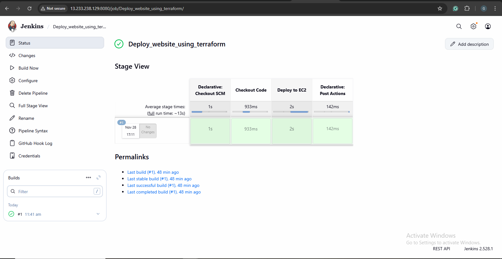
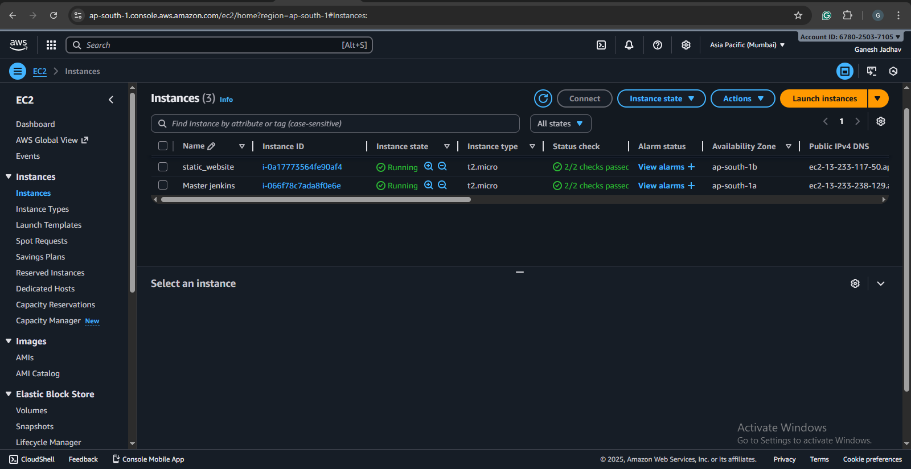
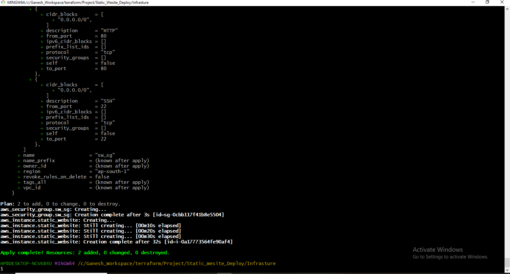

# 🚀 Deploy a Static Website using Terraform, AWS EC2 & Jenkins  
Automated CI/CD Pipeline for hosting a static website using **Terraform**, **AWS EC2**, **Apache**, and **Jenkins**.  
Whenever code is pushed to GitHub, Jenkins automatically deploys the latest version to the EC2 instance.

---

## 📘 Project Overview
This project demonstrates how to:

- Provision AWS EC2 using Terraform  
- Install and configure Apache automatically using User Data  
- Host a static website on EC2  
- Automate deployments using Jenkins CI/CD  
- Integrate GitHub Webhooks for automatic build triggers  

---

## 🏗️ Architecture


---

## ⚙️ Technologies Used
- **Terraform** (Infrastructure as Code)
- **AWS EC2**
- **Ubuntu AMI**
- **Apache Web Server**
- **Jenkins**
- **Git & GitHub**
- **CI/CD Pipeline**
- **SSH Deployment**
- **Linux**

---


---

## 🚀 Terraform Deployment
Terraform creates:

- EC2 instance  
- Security Group (Ports 22 & 80 open)  
- Apache installation via User Data  
- Clones GitHub repo into `/var/www/html`  

**main.tf**
```
provider "aws" {
  region = "ap-south-1"
}

resource "aws_security_group" "sw_sg" {
  name = "sw_sg"

  ingress {
    description = "SSH"
    from_port   = 22
    to_port     = 22
    protocol    = "tcp"
    cidr_blocks = ["0.0.0.0/0"]
  }

  ingress {
    description = "HTTP"
    from_port   = 80
    to_port     = 80
    protocol    = "tcp"
    cidr_blocks = ["0.0.0.0/0"]
  }

  egress {
    description = "all_traffic"
    from_port   = 0
    to_port     = 0
    protocol    = "-1"
    cidr_blocks = ["0.0.0.0/0"]
  }
}

resource "aws_instance" "static_website" {
  ami                    = "ami-02b8269d5e85954ef"  # Ubuntu 22.04 LTS
  key_name               = var.key_name
  instance_type          = var.instance_type
  vpc_security_group_ids = [aws_security_group.sw_sg.id]

  user_data = <<-EOF
#!/bin/bash
apt update -y
apt install -y apache2 git
systemctl enable apache2
systemctl start apache2

rm -rf /var/www/html/*

git clone https://github.com/iam-ganeshjadhav/Deploy_a_Static_Website_-_Terraform_-_AWSEc2_-_Jenkins.git /var/www/html/

chown -R www-data:www-data /var/www/html
chmod -R 755 /var/www/html
systemctl restart apache2
EOF

  tags = {
    Name = "static_website"
  }
}
```

**variables.tf**
```
variable "aws_region" {
  default = "ap-south-1"
}

variable "instance_type" {
  default = "t2.micro"
}

variable "ami_id" {
  default = "ami-02b8269d5e85954ef"
}

variable "key_name" {
  default = "jenkinsmumbai"
}

variable "jarvis_repo_url" {
  default = ""
}

variable "sw_sg" {
    default = "sw_sg"
  
}
```


### ▶ Run Terraform
```bash
terraform init
terraform apply -auto-approve
```


## 🔧 Jenkins CI/CD Pipeline

✔ Triggered by GitHub Webhook  
Whenever you push code → Jenkins pipeline starts automatically.

---

## ✔ Pipeline Stages

- Clone repository  
- SSH into EC2  
- Clean old website code  
- Clone fresh code from GitHub  
- Restart Apache  
- Website gets updated instantly  

---

## ✔ Jenkinsfile
```
groovy
pipeline {
    agent any

    triggers {
        githubPush()
    }

    environment {
        TARGET = "ubuntu@YOUR_PUBLIC_IP"
    }

    stages {
        stage("Clone Repository") {
            steps {
                git url: "https://github.com/YOUR_USERNAME/YOUR_REPO.git", branch: "main"
            }
        }

        stage("Deploy to EC2") {
            steps {
                sshagent(credentials: ['ec2-key']) {
                    sh """
                    ssh -o StrictHostKeyChecking=no $TARGET 'sudo rm -rf /var/www/html/*'
                    ssh -o StrictHostKeyChecking=no $TARGET 'sudo git clone https://github.com/YOUR_USERNAME/YOUR_REPO.git /var/www/html'
                    ssh -o StrictHostKeyChecking=no $TARGET 'sudo systemctl restart apache2'
                    """
                }
            }
        }
    }
}
```
## 🌐 Webhook Setup (GitHub → Jenkins)

**Add this URL to GitHub Webhooks:**
```
http://<JENKINS_PUBLIC_IP>:8080/github-webhook/
```
**Set event to:**

✔ Push event only  
✔ Content type: application/json  


## 🖥️ EC2 Auto-Configuration (User Data Script)

**Your EC2 User Data installs:**

- Apache  
- Git  
- Pulls your static website automatically  


## 📸 Screenshots

| Description        | Screenshot |
|-------------------|------------|
| Jenkins Pipeline  |  |
| EC2 Instance      |  |
| Website Output    |  |
| Terraform Apply   |  |
| GitHub Repo       |  |


## 📚 What I Learned (Key Skills)

**🔹 Cloud (AWS)**

- EC2 provisioning  
- IAM roles  
- Security Groups  
- Automated deployments  

**🔹 DevOps**

- Jenkins Pipelines  
- GitHub Webhooks  
- SSH deployment  
- CI/CD automation  

**🔹 Terraform**

- EC2 provisioning  
- VPC & Networking  
- User Data automation  

**🔹 Linux**

- Apache web server  
- Shell scripting  
- Permissions & ownership  


## 👨‍💻 Author  
**Ganesh Jadhav**  
Cloud & DevOps Enthusiast  
GitHub:https://github.com/iam-ganeshjadhav      
Gmail: jadhavg9370@gmail.com


